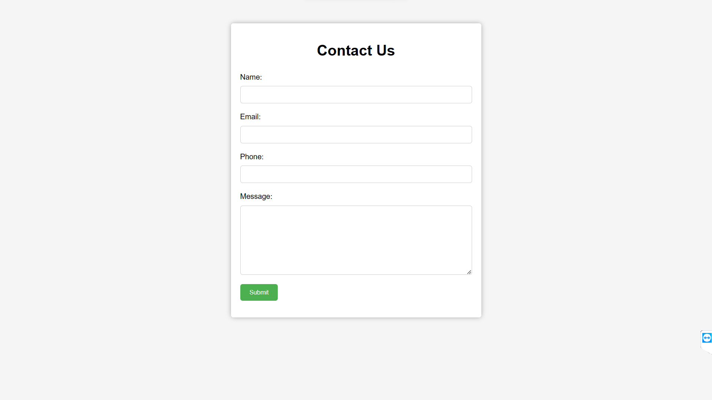

# hotel-booking

Welcome to our hotel booking site! We're excited to help you find the perfect accommodations for your next trip. Here's a brief guide on how to use our website:

Search for hotels: On our homepage, you'll find a search bar where you can enter your destination, dates of travel, and the number of guests. Click "Search" to see a list of available hotels that match your criteria.

Filter your results: Once you see the list of available hotels, you can use the filters on the left-hand side of the page to narrow down your options. You can filter by price, star rating, amenities, and more.

View hotel details: Click on a hotel to view more information, including photos, a description of the property, and guest reviews.

Book your room: Once you've found the perfect hotel, click "Book Now" to reserve your room. You'll be asked to enter your personal and payment information, and then you'll receive a confirmation email with all the details of your reservation.

Manage your booking: If you need to make any changes to your reservation, you can do so by logging into your account and going to the "My Bookings" section.

Contact customer service: If you have any questions or concerns, our customer service team is available 24/7 to assist you. You can reach us by phone, email, or live chat.

We hope you enjoy using our hotel booking site and have a wonderful trip!

# Project Screenshots

**Home**

**Register**

**log in**

**contact us**

**Cities**

**Hotels**

